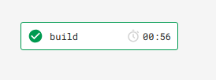
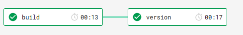
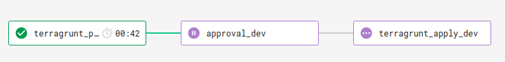

# Deploy java lambda function with terraform/terragrunt

This is a template for using terraform/terragrunt to manage lambda function with fully cicd pipepline.

### Source code under `lambda-s3`

commands can be referenced in `.circleci/config.yaml`
```
gradle build
```

### deployment

```
$ docker run -ti --rm -e AWS_PROFILE=<aws_profile> -e AWS_REGION=ap-southeast-2 -v ${HOME}/.aws:/root/.aws -v ${HOME}/.ssh:/root/.ssh -e AWS_SDK_LOAD_CONFIG=1 -v $(pwd):/apps -w /apps alpine/terragrunt:0.12.9 bash

$ cd terragrunt/non-prod/ap-southeast-2/sit/lambda/
$ terragrunt plan
$ terragrunt apply
```

### CICD pipeline

With CircleCI, I can manage the cicd with best practices. 

* commits to non-master branch, such as feature branches, bugfix branches

circle ci will only run the build and tests (such as unit test, integration tests.



* commits to master branch or pull requests are merged to master brach

circle ci will run build and add incremental semantic version automatically



* if new version detected (new tag applied on master branch)

circlec ci will run the deployment dry-run to dev environment first and waiting for approval, then deploy to dev environment. 



You can add other environments, such as staging, production, for your project.
